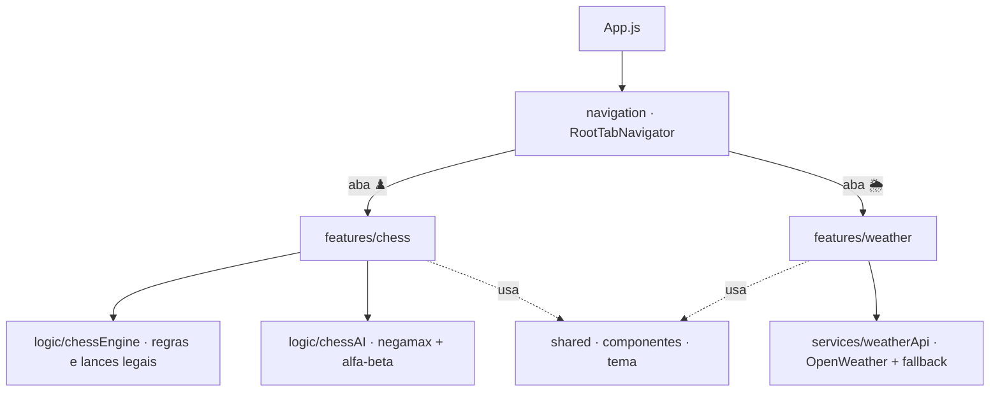

<p align="center">
  
</p>

<h1 align="center">ChessMate</h1>

<p align="center">
  Xadrez contra IA + consulta de clima, em um app mobile React Native (Expo).
</p>

<p align="center">
  
  
  
  
</p>

---

## ✨ Funcionalidades

**♟️ Xadrez contra IA**
- Oponente com **negamax + poda alfa-beta** (2 ply) e *piece-square tables*.
- Regras completas: **roque, en passant, promoção** (seleção manual com auto-dama em 5s), xeque e xeque-mate.
- **Empates** por repetição de posição (3×) e regra dos 50 lances.
- Relógio de **10 minutos por lado**, placar de capturas, contador de lances e orientação do tabuleiro pelo jogador.

**🌦️ Clima**
- Lista de capitais brasileiras e detalhes por cidade.
- OpenWeatherMap com **fallback automático** (Open-Meteo) quando não há chave configurada.

## 🧱 Stack

| Camada | Tecnologia |
|---|---|
| App | Expo SDK 54 · React Native 0.81 |
| Navegação | React Navigation (tabs + stack) |
| Rede | Axios |
| Lógica de jogo | JavaScript puro (engine desacoplada da UI) |

## 🏗️ Arquitetura

Organização **feature-based**: cada domínio é autocontido em `src/features/<feature>`, o código transversal vive em `src/shared` e a composição acontece em `src/navigation`. A regra do xadrez é **separada da UI** — `chessEngine` cuida das regras e `chessAI` da busca.



## ▶️ Como executar

```bash
npm install
npm run start      # abre o Metro; escaneie o QR com o Expo Go
```

```bash
npm run android    # emulador/dispositivo Android
npm run ios         # simulador iOS
npm run web         # navegador
npm test            # testes
```

**Requisitos:** Node 20 LTS · Expo Go (Android/iOS) ou emulador/simulador.

### 🔑 Chave da API de clima (opcional)
Sem chave, o app usa o fallback (Open-Meteo) para as cidades já mapeadas. Para usar a OpenWeatherMap: gere uma chave em [openweathermap.org/api](https://openweathermap.org/api) e substitua `COLOQUE_SUA_KEY_AQUI` em `src/features/weather/services/weatherApi.js`.

## 🖥️ Apresentação

`apresentacao.html` (na raiz do projeto) é um deck de slides navegável — abra direto no navegador para a visão geral de projeto, arquitetura e stack.

---

<p align="center">
  <sub>📚 <b>ADS306 — Desenvolvimento para Dispositivos Móveis e Games</b> · Análise e Desenvolvimento de Sistemas — UniViçosa</sub><br/>
  <sub>Parte do repositório-portfólio <a href="../../">UniVicosa</a> · Curso concluído 🎓 · 👤 Bernardo Cordeiro Motta</sub>
</p>
