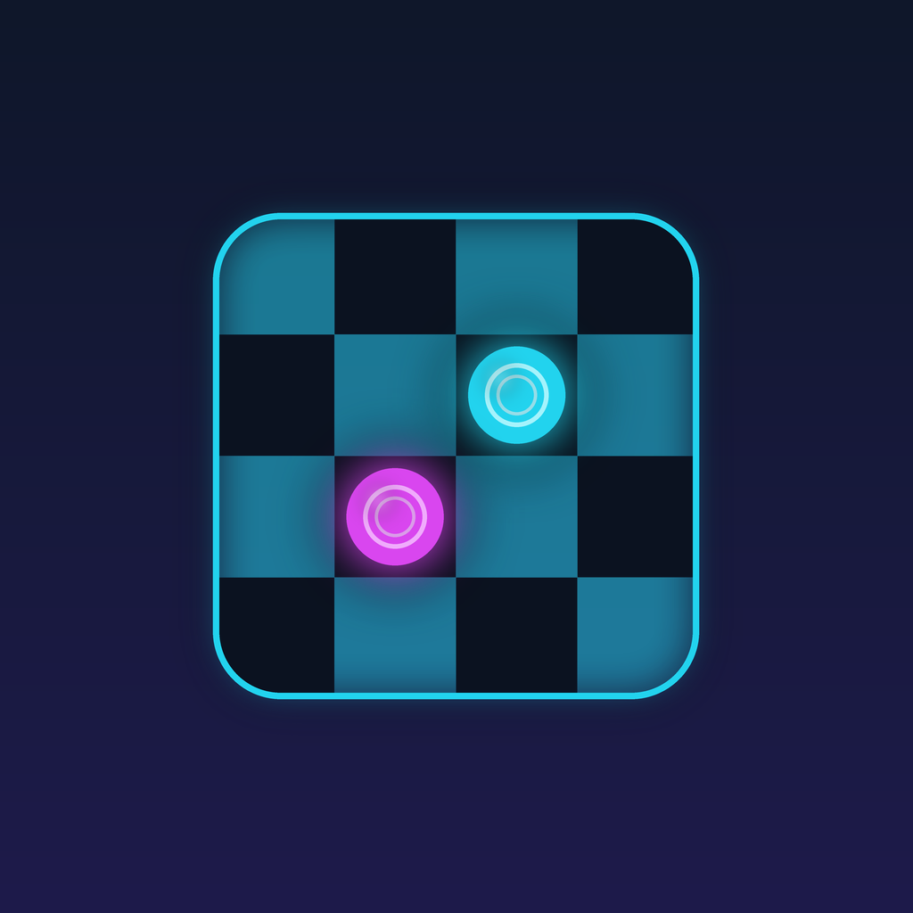
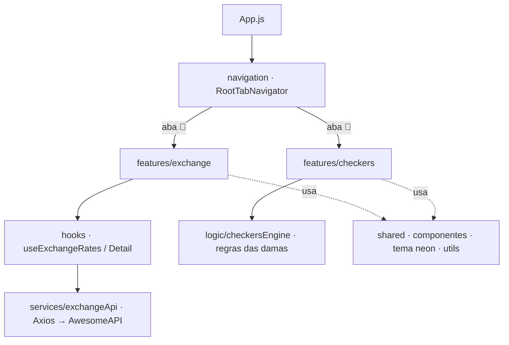

<p align="center">
  
</p>

<h1 align="center">DamaLink</h1>

<p align="center">
  App mobile híbrido: <b>utilitário de câmbio</b> (cotações em tempo real) + <b>jogo de damas 2D</b>.
</p>

<p align="center">
  
  
  
  
</p>

---

## ✨ Funcionalidades

**💱 Aba Câmbio** — consome a [AwesomeAPI](https://economia.awesomeapi.com.br)
- Lista dos principais pares do real (BRL) com cotação de compra, variação e atualização.
- Estados de **loading, erro e vazio** tratados; resiliência a falhas de rede e timeout.

**🔴 Aba Jogo (Damas)** — regras completas em lógica pura
- Tabuleiro 8×8 responsivo, **captura obrigatória e encadeada**, promoção a dama.
- Dama move/captura em diagonal por qualquer distância; brancas sempre começam.
- Bot adversário, timer de turno (30s), placar e modal de fim de jogo.

## 🧱 Stack

| Camada | Tecnologia |
|---|---|
| App | React Native (Expo) |
| Navegação | React Navigation (Bottom Tabs + Native Stack) |
| Rede | Axios (AwesomeAPI) |
| Estado | Hooks customizados (`useExchangeRates`, `useExchangeDetail`) |
| Lógica de jogo | JavaScript puro (`checkersEngine`) |

## 🏗️ Arquitetura

Organização **feature-based**: cada domínio (damas, câmbio) é autocontido em `src/features/<feature>`, com telas, hooks e lógica próprios. O código transversal vive em `src/shared` e a regra do jogo é separada da UI.



## ▶️ Como executar

```bash
npm install
npm start          # abre o Metro; escaneie o QR com o Expo Go
```

```bash
npm run android    # emulador/dispositivo Android
npm run ios         # simulador iOS
npm run web         # navegador
```

**Requisitos:** Node 20 LTS · Expo Go (Android/iOS) ou emulador/simulador.

## 🖥️ Apresentação

`apresentacao.html` (na raiz do projeto) é um deck de slides navegável com a visão geral de projeto, arquitetura e stack — abra direto no navegador.

---

<p align="center">
  <sub>📚 <b>ADS306 — Desenvolvimento para Dispositivos Móveis e Games</b> · Análise e Desenvolvimento de Sistemas — UniViçosa</sub><br/>
  <sub>Parte do repositório-portfólio <a href="../../">UniVicosa</a> · Curso concluído 🎓 · 👤 Bernardo Cordeiro Motta</sub>
</p>
