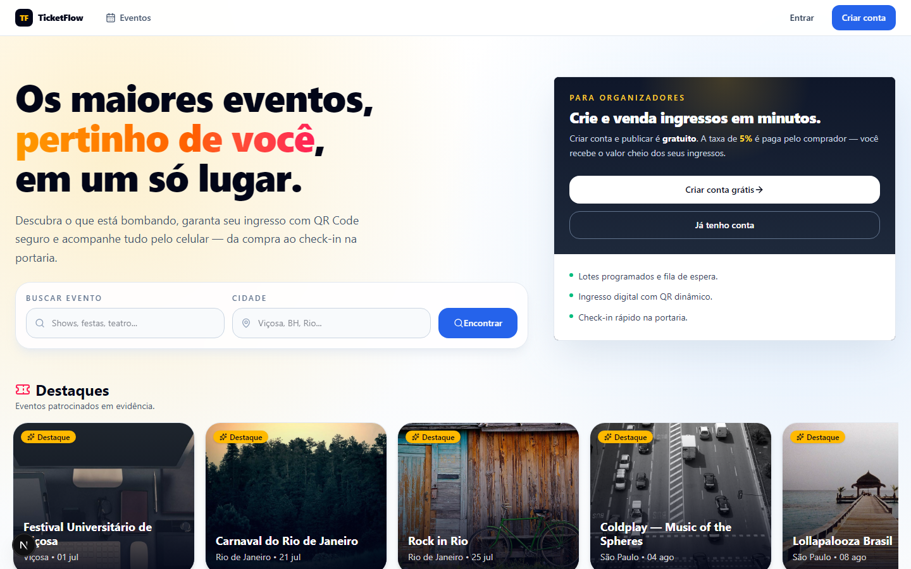
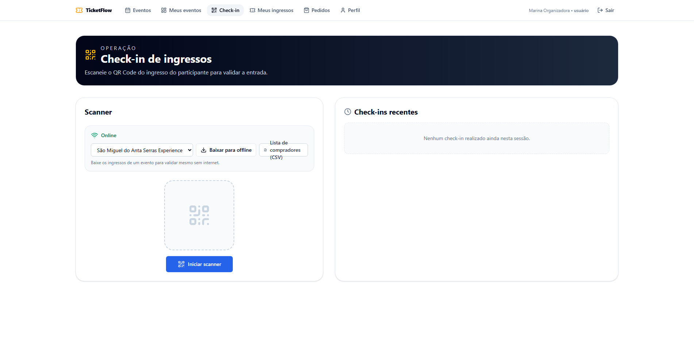
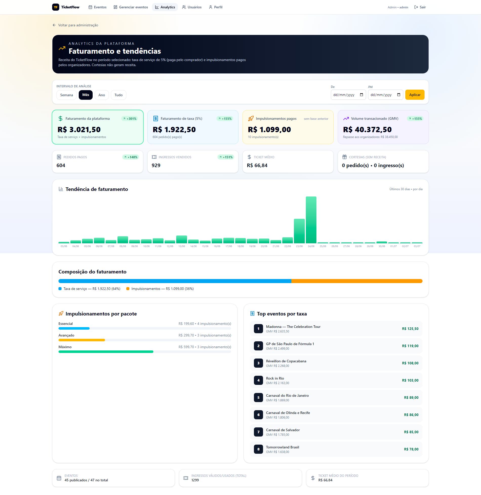
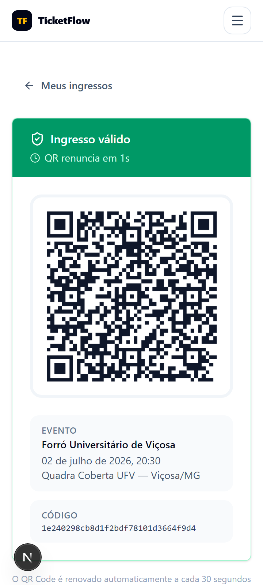
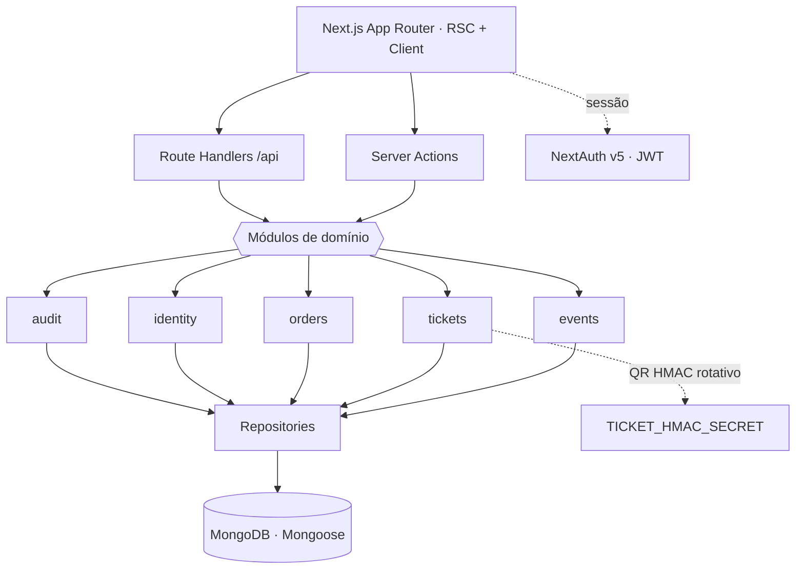

<h1 align="center">🎟️ TicketFlow</h1>

<p align="center">
  Plataforma web full-stack para <b>venda de ingressos online</b>: qualquer pessoa cria e gerencia eventos,
  vende ingressos com <b>QR Code dinâmico</b> e faz <b>check-in — inclusive offline</b>.
</p>

<p align="center">
  
  
  
  
  
  
  
</p>

> 📄 Este é o **software do TCC**. A monografia (LaTeX) está em **[`../TCC_Source`](../TCC_Source)** e o PDF compilado em [`public/tcc.pdf`](public/tcc.pdf).

---

## 📸 Telas

| Home pública | Página de evento |
|:---:|:---:|
|  |  |
| **Check-in (scanner QR + offline)** | **Analytics da plataforma** |
|  |  |

<p align="center">
  <br/>
  <sub>Ingresso no celular com <b>QR renovado a cada 30s</b> (anti-print).</sub>
</p>

## ✨ O que faz

- **Eventos**: criação/gestão pública, capas, eventos em **destaque** (patrocinados) com prioridade na home.
- **Ingressos**: lotes programados, fila de espera, checkout com **taxa de serviço de 5%** e **QR dinâmico** (HMAC rotativo, com titular e CPF ocultável).
- **Check-in**: scanner QR com **modo offline** (cache + fila + sincronização) e lista de compradores em CSV.
- **Analytics**: faturamento, GMV, ticket médio e tendências com intervalos (semana/mês/ano/total + período custom).
- **Privacidade/LGPD**: consentimento de cookies, central em `/privacidade`, exportar dados (JSON), corrigir perfil e excluir conta.
- **Segurança**: middleware com headers de segurança + proteção de rotas; health endpoint com verificação de DB.

## 💰 Modelo de negócio

Criar conta e organizar eventos é **gratuito**. A plataforma monetiza por:
- **Taxa de serviço de 5%** sobre as vendas (paga pelo comprador; repasse de 100% ao organizador).
- **Destaque/promoção** de eventos (patrocinados ganham posição na home e na listagem).

## 🧱 Stack

| Camada | Tecnologia |
|---|---|
| Framework | Next.js 16 (App Router) + Turbopack |
| Linguagem | TypeScript (strict) |
| Dados | MongoDB + Mongoose |
| UI | TailwindCSS + shadcn/ui |
| Auth | NextAuth v5 (Credentials + JWT) |
| Testes | Vitest (unitário) + Playwright (e2e) |
| Deploy | Docker (multi-stage, Next standalone) |

## 🏗️ Arquitetura

Domínio organizado em **módulos** (`modules/<domínio>`) com modelos, repositórios e schemas próprios; a aplicação chega via **Server Actions** e **Route Handlers**.



## 👥 Papéis (acesso por evento)

O acesso global é apenas **usuário** ou **admin**. Qualquer usuário cria eventos (virando organizador) e adiciona operadores por evento (`EventStaff`).
- **usuário** — compra ingressos, cria/gerencia os próprios eventos e faz check-in onde é organizador/operador.
- **operador (por evento)** — check-in e download de compradores daquele evento.
- **admin** — gerencia todos os eventos e usuários; analytics e cortesias.

## ▶️ Como rodar

```bash
pnpm install
cp .env.example .env.local     # preencha ao menos MONGODB_URI
pnpm seed                       # popula o cenário de exemplo (Viçosa)
pnpm dev                        # http://localhost:3000
```

**Requisitos:** Node.js 20+ · pnpm · uma instância de MongoDB.

<details>
<summary>📜 Scripts principais</summary>

| Comando | O que faz |
| --- | --- |
| `pnpm dev` / `pnpm build` / `pnpm start` | Dev com hot reload / build de produção / servir build |
| `pnpm typecheck` / `pnpm lint` / `pnpm lint:fix` | Type-check e lint |
| `pnpm test` / `pnpm test:watch` / `pnpm test:e2e` | Vitest (unitário) e Playwright (e2e) |
| `pnpm seed` / `pnpm seed:vicosa` / `pnpm seed:brasil` | Popula dados (**limpa e recria**) |
| `pnpm db:reset` | Reseta as coleções |

> ⚠️ Os `seed`/`db:reset` **apagam e recriam** os dados — use apenas em base de desenvolvimento.
</details>

<details>
<summary>🔑 Variáveis de ambiente & contas de teste</summary>

**Obrigatórias:** `MONGODB_URI`, `NEXTAUTH_SECRET`, `NEXTAUTH_URL`, `JWT_SECRET`, `TICKET_HMAC_SECRET`
**Opcionais:** `RESEND_API_KEY` (e-mail), `STRIPE_SECRET_KEY` (o checkout atual é simulado). Lista completa em `.env.example`.

**Contas do seed** (senha `Password123!`):
- `admin@ticketflow.com` — admin
- `organizer1@ticketflow.com` — organizador
- `operator@ticketflow.com` — operador
- `buyer1@ticketflow.com` — comprador (com pedidos e ingressos)
</details>

## 📄 Documentação

Plano de projeto completo (arquitetura, requisitos, escopo, cronograma e custos) em [`TCC.md`](TCC.md).

---

<p align="center">
  <sub>📚 <b>ADS405 — Gestão de Projetos</b> · Análise e Desenvolvimento de Sistemas — UniViçosa</sub><br/>
  <sub>Parte do repositório-portfólio <a href="../../">UniVicosa</a> · Curso concluído 🎓 · 👤 Bernardo Cordeiro Motta</sub>
</p>
